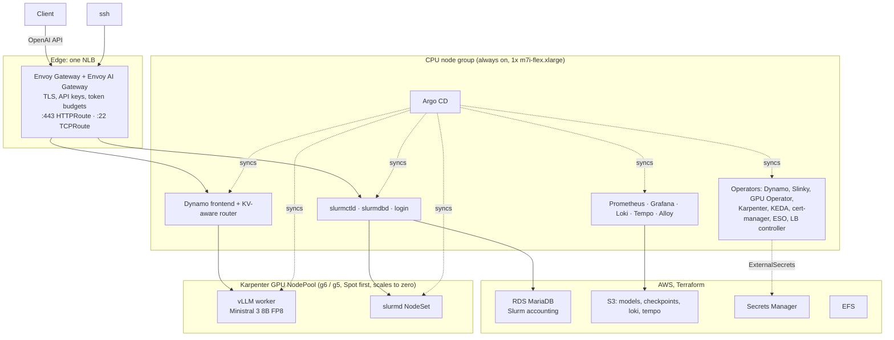

# k8s-ministral-8b-platform

Slurm (Slinky) and NVIDIA Dynamo inference sharing one Karpenter-managed GPU pool
on Amazon EKS, entirely as code, created and destroyed from CI.

The platform runs `mistralai/Ministral-3-8B-Instruct-2512` (FP8) with vLLM on
NVIDIA L4 GPUs behind an Envoy AI Gateway, and a Slurm cluster whose `slurmd`
nodes scale from zero on the same GPU pool. Everything below Kubernetes is
Terraform + Terragrunt driven by GitHub Actions over OIDC; everything above is
Argo CD. Nothing runs permanently: a workflow creates the environment, tests it
and destroys it, then an orphan audit confirms the account is empty.

The account-level prerequisites (state bucket, OIDC roles, budget, CloudTrail,
secret placeholders) live in
[k8s-ministral-8b-bootstrap](https://github.com/Badmamane/k8s-ministral-8b-bootstrap).

## Architecture



Three decisions shape it, each recorded as an ADR in [`docs/adr/`](docs/adr/README.md):

- **[ADR-001](docs/adr/slurm-on-eks-via-slinky.md)** Slurm on EKS with the
  SchedMD Slinky operator rather than ParallelCluster or HyperPod, so batch and
  inference share one accelerator pool, one autoscaler and one security model.
- **[ADR-002](docs/adr/inference-dynamo-and-gateway.md)** NVIDIA Dynamo as the
  inference layer (frontend, KV-cache-aware router, vLLM workers, operator and
  CRDs); Envoy AI Gateway at the edge for authentication, quotas and TLS only.
- **[ADR-003](docs/adr/destroy-by-ownership.md)** Destroy by ownership and
  finalizers, not cleanup scripts: Terraform owns the root objects of each
  cascade (Argo root Applications, Karpenter NodePool), Kubernetes finalizers do
  the waiting, and a tag-based orphan check verifies the result.

## Measured

Numbers from the last full cycle (September 2026, `us-east-1`, one g6.xlarge /
NVIDIA L4 for the GPU side):

| Step | Duration |
|---|---|
| Fresh `apply` of the six Terragrunt units, 4 AZs, 24 Argo apps Synced/Healthy | 33 min |
| `destroy` of the six units, no orphan left | 22 min |
| Cold start to first token (node 1m33 · image pull 4m05 · 20 GB download 3m28 · weight load 1m16 · KV cache warm-up ~2 min) | 12 min 33 s |
| GPU node scale-from-zero to a Slurm job's output, warm images | ~2 min |

Serving benchmark, one replica, `vllm bench serve --backend openai-chat`,
random 512-in / 128-out prompts, 64 requests, concurrency 8
([`docs/bench/replicas-1.json`](docs/bench/replicas-1.json)):

| Metric | Value |
|---|---|
| Output throughput | 167 tok/s (peak 200) |
| Total token throughput | 1,522 tok/s |
| Requests | 1.31 req/s |
| TTFT mean / p99 | 620 ms / 901 ms |
| TPOT mean | 43 ms |
| ITL p99 | 131 ms |
| Cost at 0.80 USD/h on-demand | ~1.34 USD per 1M output tokens |

KV cache on the L4: 74,256 tokens at `max_model_len` 16,384, 4.5x concurrency.
A full day of development, with the environment up for about four hours, costs
around 5 USD.

## Repository map

```
live/           Terragrunt: root.hcl (backend, provider, tags) and live/dev/ with one env.hcl
                holding every environment value and one directory per unit
modules/        plain Terraform modules, one per unit: network, security, storage, eks,
                karpenter (incl. a local Helm chart for NodePool/EC2NodeClass), gitops
gitops/apps/    Argo CD app-of-apps: platform/, observability/ and workloads/ (slurm,
                inference, gateway); every chart version pinned
gitops/charts/  local Helm charts rendered by Argo CD: gateway, ministral (DynamoGraphDeployment),
                platform-manifests, observability-manifests, slurm-manifests
scripts/        orphan-check.sh: tag-based audit that confirms each candidate with the service API
tests/          smoke test run by CI and a GPU smoke Job
docs/adr/       architecture decision records; docs/bench/ raw benchmark output
.github/        ci (lint + read-only plan), e2e-ephemeral (apply, test, destroy), nightly-sweep
```

Dependency graph of the units, carried by Terragrunt `dependency` blocks with mock
outputs so `validate` and `plan` work without a cluster:

```
network -> security -> storage -> eks -> karpenter -> gitops
```

Every unit reads its values from `live/dev/env.hcl`; adding an environment is a
new `live/<env>/` directory with its own `env.hcl`, backed by its own AWS account.
Modules contain no literals: every tunable is a typed variable.

## Layers

**AWS (Terraform, `terraform-aws-modules` throughout).** VPC with 4 AZs, one NAT
gateway, S3 gateway endpoint, flow logs. Two customer-managed KMS keys (EKS
secrets envelope; storage at rest for S3, EFS, ECR, RDS and node volumes). S3
buckets for models, checkpoints, Loki and Tempo; EFS; ECR repositories with
immutable tags and scan-on-push; RDS for MariaDB holding the Slurm accounting
database with an RDS-managed master password. EKS 1.35 in API authentication
mode with access entries, control-plane logs, and the managed add-ons
(VPC CNI, CoreDNS, kube-proxy, Pod Identity agent, metrics-server). One
on-demand CPU node group labelled `workload=platform`.

**GPU capacity (Karpenter 1.14).** A single NodePool: g6 and g5 families, xlarge
and 2xlarge, Spot then on-demand, GPU limit 2, `nvidia.com/gpu` taint, AL2023
GPU AMI alias, 100 GB encrypted root volume, consolidation 60 s after the last
GPU pod leaves, 30-day node expiry. The controller policy denies launching any
instance without the `Project` tag.

**Platform (Argo CD, `gitops/apps/platform`).** NVIDIA GPU Operator (driver
and toolkit from the AMI, DCGM exporter on), AWS Load Balancer Controller,
External Secrets Operator with a `ClusterSecretStore` on Secrets Manager, KEDA,
cert-manager, Envoy Gateway and Envoy AI Gateway (CRDs and controllers as
separate apps), NVIDIA Dynamo operator, Slinky `slurm-operator` and its CRDs,
plus Redis for the gateway's rate limiter, a self-signed `ClusterIssuer`, and a
gp3 default `StorageClass`.

**Observability (`gitops/apps/observability`).** kube-prometheus-stack, Loki and
Tempo on S3 through Pod Identity, Alloy as a DaemonSet shipping pod logs and
accepting OTLP. Prometheus scrapes `vllm:*`, `dynamo_*` and `DCGM_FI_*` series;
the Grafana admin password comes from Secrets Manager via an `ExternalSecret`.

**Workloads (`gitops/apps/workloads`).**

- *Inference*: a `DynamoGraphDeployment` with the Dynamo frontend and router on
  the CPU nodes and vLLM workers on the GPU pool, text-only
  Ministral 3 8B FP8, Hugging Face cache on an emptyDir so a container restart
  does not re-download the weights.
- *Slurm*: Slinky `slurm` chart with `slurmctld`, `slurmdbd` (accounting on RDS
  over TLS, password delivered by an `ExternalSecret` reading the RDS-managed
  secret), a login set reachable over SSH, and a `gpu` NodeSet at 0 replicas
  with `Gres=gpu:1` and the GPU taint toleration.
- *Gateway*: `GatewayClass`, `EnvoyProxy` with NLB annotations and the ingress
  security group, a cert-manager `Certificate`, a `Gateway` with a TLS listener
  on 443 and a TCP listener on 22, an AI route to the Dynamo frontend with the
  OpenAI schema, a `SecurityPolicy` with API-key authentication forwarding
  `x-client-id`, a `BackendTrafficPolicy` enforcing a per-client token budget
  (2M tokens per hour), and a `TCPRoute` with `ReferenceGrant` to the Slurm login
  Service, so one NLB serves both the inference API and SSH.

Environment values (cluster name, region, VPC, security group, bucket names, RDS
host, secrets prefix) are published once by Terraform as annotations on the Argo
CD in-cluster `Secret`; `ApplicationSet` cluster generators read them, so the
GitOps tree contains no account-specific literals.

## Security model

- **No long-lived cloud credentials.** CI assumes two OIDC roles created by the
  bootstrap: a plan role (`ReadOnlyAccess` + state access) bound to GitHub
  environment `dev`, and a lifecycle role (`PowerUserAccess` + IAM writes scoped
  to the project prefix, with an explicit deny on the bootstrap roles) bound to
  environment `dev-deploy`.
- **No secrets in Git or in state.** Secrets Manager entries are created as
  placeholders, filled by hand, and delivered to pods by External Secrets; a
  Terraform precondition refuses a deploy key that is still the placeholder.
  The gateway API keys are one JSON document with one field per client.
- **Least privilege in the cluster.** EKS Pod Identity per service account (LB
  controller, External Secrets, Loki, Tempo), access entries instead of
  `aws-auth`, and a scoped Karpenter controller policy.
- **Encryption and reach.** Customer-managed KMS keys everywhere at rest; the
  EKS API endpoint and the NLB only admit the operator's CIDRs (`ADMIN_CIDRS`)
  plus the CI runner's address for the duration of a run.
- **Supply chain.** Every GitHub Action pinned to a commit SHA, every chart and
  module to a version, every CLI to a version through `mise`; Renovate opens the
  upgrade PRs. `pre-commit` runs yamllint, `terraform fmt`/`validate`, tflint,
  kubeconform on the rendered charts, private-key and AWS-credential detection;
  `checkov` scans the Terraform.

## Lifecycle

| Workflow | Trigger | What it does |
|---|---|---|
| `ci` | push, PR | lint, then `terragrunt run --all validate` and `plan` with the read-only role; the plan is posted on the PR |
| `e2e-ephemeral` | manual | `apply` the six units, run the smoke test, `destroy`, `orphan-check` |
| `nightly-sweep` | 01:30 UTC | admit the runner to the API endpoint, `destroy` whatever is still up, `orphan-check` |

The AWS-backed jobs run only once the bootstrap outputs are configured as
repository variables; the lint job needs no credentials.

Destroy order is the reverse of the dependency graph. Two Argo root
Applications, `root` (platform, observability) and `workloads`, are created in
that order by Terraform so the Load Balancer Controller and the operators
outlive the Services and custom resources they reconcile; Helm's uninstall waits
for the finalizer cascade, NLB release included. `scripts/orphan-check.sh` then
lists everything tagged `Project=k8s-ministral-8b`, confirms each candidate
with the owning service's describe call (the tagging index lags deletions by
hours) and fails the run if anything billable survived.

## Running it

Prerequisites: an AWS account bootstrapped with
[k8s-ministral-8b-bootstrap](https://github.com/Badmamane/k8s-ministral-8b-bootstrap),
G and VT instance quotas above zero, and `mise`.

```bash
mise install
export ADMIN_CIDRS=203.0.113.4/32          # who may reach the API endpoint and the NLB
$EDITOR live/dev/env.hcl                   # admin_principal_arns, repo_url
make validate                              # terragrunt run --all validate, mock outputs
make plan
CREATE=1 make apply                        # ~30 min
make test
DESTROY=1 make destroy                     # ~20 min
make orphan-check
```

Then, with the gateway's NLB hostname and a key from the `gateway-api-keys` secret:

```bash
curl -sk https://$EDGE/v1/chat/completions \
  -H "x-api-key: $KEY" -H 'content-type: application/json' \
  -d '{"model":"mistralai/Ministral-3-8B-Instruct-2512","messages":[{"role":"user","content":"Hello"}]}'
ssh root@$EDGE sinfo
```

## Status and roadmap

Working end to end: infrastructure, GitOps tree, Slurm with accounting on RDS,
Dynamo + vLLM serving, the edge with API keys, token budgets and SSH
pass-through, observability, the CI lifecycle and the orphan audit.

Next, in order: KEDA `ScaledObject` on the Slurm NodeSet (pending jobs to GPU
node to zero), the two-replica benchmark showing the KV-aware router's effect,
a LoRA adapter trained by a Slurm job and loaded through `DynamoModel`, Grafana
and Argo CD UIs through the edge, then Dynamo's SLA Planner with disaggregated
prefill and decode.

## Conventions

Values live in `env.hcl`, modules hold typed variables only. Community modules
from `terraform-aws-modules` whenever one exists. Unit order is carried by
`dependency` blocks, never by numeric prefixes. One manifests chart per Argo
group. Comments only for non-obvious decisions. Guard rails on every
destructive target: `CREATE=1 make apply`, `DESTROY=1 make destroy`.
